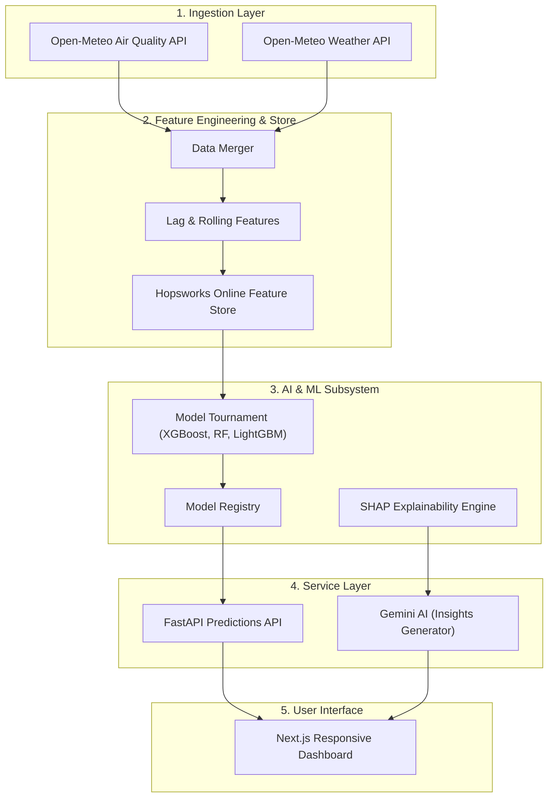

    <h1 style="font-size: 3rem; margin-bottom: 2rem;">10Pearls AQI Predictor Project</h1>
    <h2 style="font-size: 1.5rem; color: #666;">Submitted by: Data Science Intern Afnan Shoukat</h2>

# Internship Final Project Report: AirLyst
### Subject: Precision Air Quality Index (AQI) Forecasting System
**Prepared by:** Afnan Shoukat  
**Date:** May 27, 2026

---

## 1. Executive Summary
The **AirLyst** project is a production-grade MLOps (Machine Learning Operations) system designed to provide 72-hour predictive insights into urban air quality. Unlike standard weather apps that offer only current observations, AirLyst leverages advanced regression models and real-time data pipelines to forecast pollution trends, helping users make informed decisions about their respiratory health.

---

## 2. System Architecture
The project follows a decoupled, modular architecture. It integrates automated data ingestion, cloud-based feature storage, a machine learning training tournament, and a high-performance web dashboard.

---

## 3. Technology Stack
| Component | Technology | Purpose |
| :--- | :--- | :--- |
| **Language** | Python 3.9+ | Main logic and AI model development. |
| **Web Backend** | FastAPI | High-speed API for serving real-time forecasts. |
| **Frontend** | Next.js, TailwindCSS | Professional, responsive user dashboard. |
| **Database** | Hopsworks Feature Store | Cloud storage for consistent training and inference data. |
| **AI Models** | XGBoost, LightGBM, Ridge | High-accuracy regression for time-series forecasting. |
| **Explainability** | SHAP (Shapley Values) | Identifying which factors (wind, humidity) drive pollution. |
| **Generative AI**| Gemini 2.0 Flash | Translating complex data into simple human insights. |

---

## 4. The MLOps Lifecycle

### A. Data Ingestion & Engineering
The system automatically pulls data from external APIs. We use **Pydantic** to validate the data, ensuring no corrupt information enters the system. We engineered complex features such as:
*   **Temporal Lags**: Using previous hours' AQI to predict the next hour.
*   **Rolling Averages**: Calculating 6-hour and 24-hour trends to capture moving patterns.

### B. The Model Tournament
Rather than relying on a single model, we implemented a **Tournament Selection** process. The system trains multiple models (Ridge, Random Forest, XGBoost, and LightGBM) and evaluates them using:
*   **MAE (Mean Absolute Error)**: To measure average prediction error.
*   **R² Score**: To measure how well the model captures data variance.
The best-performing model is automatically promoted to the **Model Registry**.

### C. Explainable AI (XAI)
To make the AI trustworthy, we integrated **SHAP**. This tells us, for example, if the AQI is rising because of "Low Wind Speed" or "High PM2.5 Lags." We then use the **Gemini AI API** to convert these technical scores into simple, 2-sentence summaries for the end user.

---

## 5. Key Project Features
*   **72-Hour Predictions**: Hourly granularity for the next 3 days.
*   **AI-Powered Insights**: Real-time explanations of pollution drivers.
*   **Professional Dashboard**: Includes interactive charts, EPA-standard color coding, and responsive design for mobile.
*   **Automated Pipeline**: The system is designed to update its data and predictions daily with zero manual effort.

---

## 6. Challenges & Professional Growth
During this internship, I faced and overcame several real-world engineering hurdles:

1.  **API Reliability & Selection**: Initially, the first weather API I used provided inconsistent and poorly formatted data. I decided to pivot to the **Open-Meteo API**, which offered high-reliability meteorological and air quality data, ensuring a stable foundation for the project.
2.  **Solving Overfitting with Data Volume**: I initially trained the model on 6 months of data, but it suffered from overfitting. To fix this, I expanded the dataset to **1.5 years of historical data**, allowing the model to learn long-term seasonal patterns and significantly improving its accuracy on unseen data.
3.  **Model Selection (ML vs. Deep Learning)**: I experimented with Deep Learning models, but found they made larger errors and were less stable for this specific forecasting task. I made the strategic decision to switch back to **Machine Learning models (XGBoost, LightGBM, Random Forest)**, which provided much more precise and reliable results.
4.  **Automation & Data Pipeline Fixes**: I encountered challenges with **GitHub Actions** where data was being fetched but failing to upload to Hopsworks. I debugged the authentication and environment issues to ensure the pipeline was fully automated.
5.  **Smart Training Strategy**: To avoid data redundancy, I utilized Hopsworks' time-based features to ensure only unique records are stored. I also established a **weekly retraining schedule**; since daily data changes are subtle, retraining too often would risk overfitting the model to recent noise.
6.  **Full-Stack Integration**: Developing a seamless connection between a Python-based ML engine and a React-based frontend using FastAPI.

---

## 7. Conclusion
The **AirLyst** project demonstrates a successful implementation of a modern MLOps pipeline. By combining data engineering, advanced machine learning, and generative AI, I have built a tool that is not only technically sound but also provides genuine value to society by making air quality data accessible and understandable.

---
**Submitted by:** Afnan Shoukat  
**Position:** Data Science Intern at 10Pearls  
**Final Status:** Successfully Completed  

