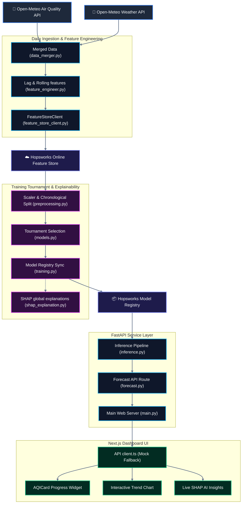
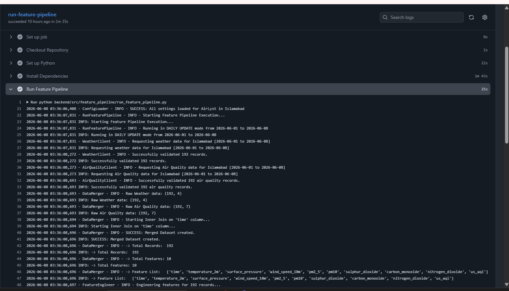
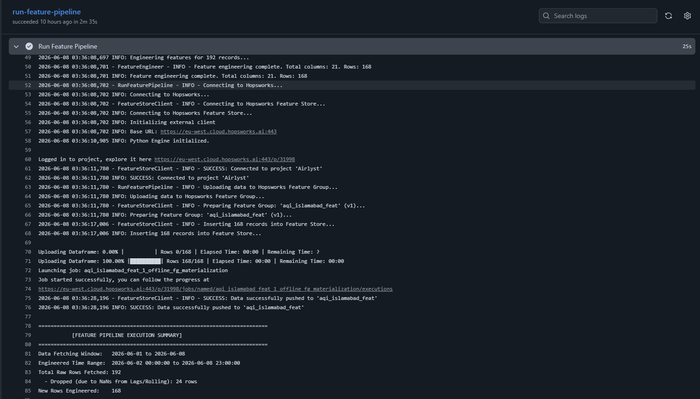
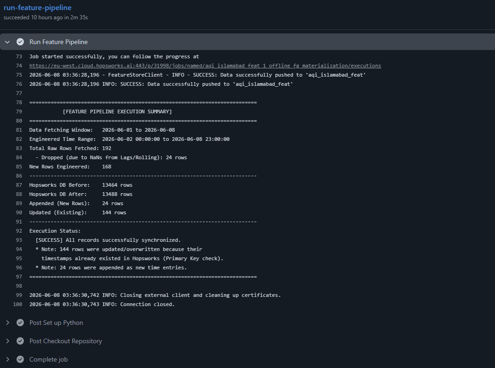
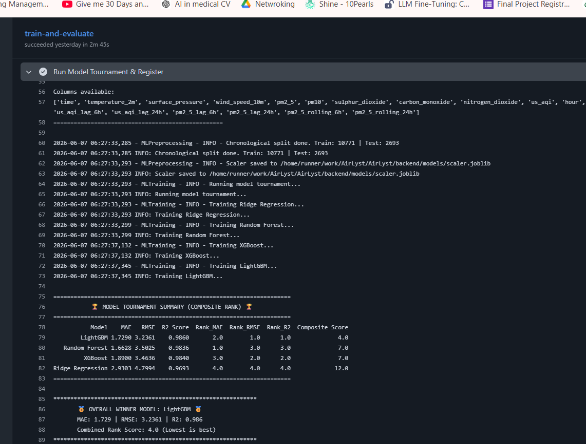
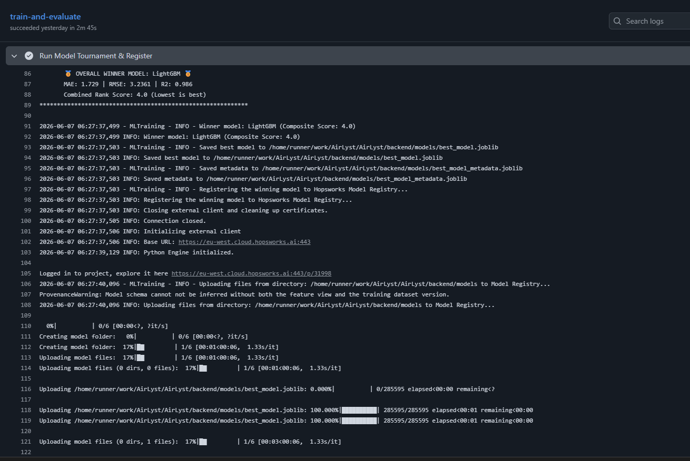
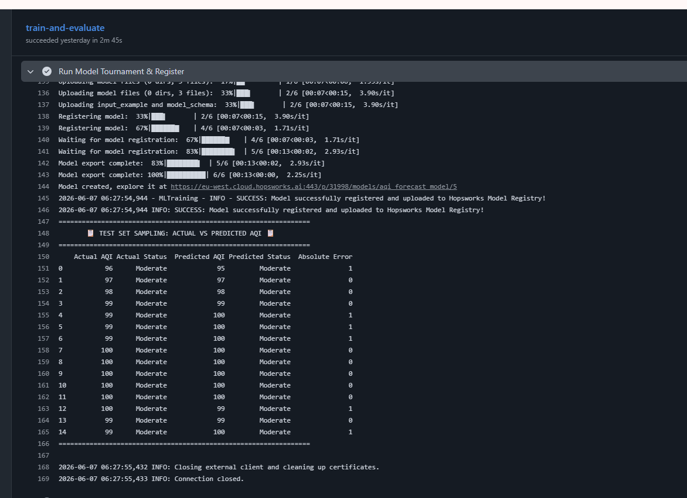

<div align="center">

# 🌌 <span style="background: linear-gradient(135deg, #00f2fe 0%, #4facfe 100%); -webkit-background-clip: text; -webkit-text-fill-color: transparent; font-weight: 800; font-size: 3rem;">AirLyst: Precision AQI Engine</span>

### 🌬️ "Predicting the air you breathe, powered by state-of-the-art MLOps."

<div align="center">
  <h3>🚀 <a href="https://air-lyst.vercel.app" target="_blank"><b>Click Here to View the Live AirLyst Dashboard</b></a> 🚀</h3>
  <a href="https://air-lyst.vercel.app" target="_blank">
    
  </a>
</div>
<br/>

<p align="center">
  <a href="https://github.com/21Afnan/AirLyst/actions/workflows/feature_pipeline.yml">
    
  </a>
  <a href="https://github.com/21Afnan/AirLyst/actions/workflows/training_pipeline.yml">
    
  </a>
</p>

[](https://www.python.org/)
[](https://fastapi.tiangolo.com/)
[](https://nextjs.org/)
[](https://tailwindcss.com/)
[](https://www.hopsworks.ai/)

</div>

---

## 📖 Executive Summary

The **AirLyst** project is a production-grade MLOps (Machine Learning Operations) system designed to provide 72-hour predictive insights into urban air quality. Unlike standard weather apps that offer only current observations, AirLyst leverages advanced regression models and real-time data pipelines to forecast pollution trends, helping users make informed decisions about their respiratory health. It features an automated data ingestion pipeline, cloud-based feature storage, a machine learning training tournament, explainable AI (SHAP), generative AI translations, and a high-performance web dashboard.

---

## ✨ Key Project Features

*   **72-Hour Predictions**: Hourly granularity for the next 3 days.
*   **AI-Powered Insights**: Real-time explanations of pollution drivers utilizing SHAP and Gemini 2.0 Flash.
*   **Professional Dashboard**: Includes interactive charts, EPA-standard color coding, and responsive design for mobile.
*   **Automated Pipeline**: The system is designed to update its data and predictions daily with zero manual effort.
*   **Model Tournament**: Retrains weekly. Competes Ridge, Random Forest, XGBoost, and LightGBM models using custom chronological time-series splitting to avoid future data leakage.

---

## 📷 Interactive Dashboard Showcase

Here is a visual walk-through of the premium **AirLyst Next.js Frontend Dashboard** showing real-time observations, 72-hour forecast charts, and local AI explanation widgets:

<div align="center">
  <table>
    <tr>
      <td width="33.3%" align="center">
        
        <br />
        <b>1. Main Dashboard View</b>
        <p><i>Real-time AQI dials, weather metrics, and daily predictions.</i></p>
      </td>
      <td width="33.3%" align="center">
        
        <br />
        <b>2. AI SHAP Insights</b>
        <p><i>Local Shapley explanations translating variables to human language.</i></p>
      </td>
      <td width="33.3%" align="center">
        
        <br />
        <b>3. Hourly Trends Chart</b>
        <p><i>EPA-banded 24-hour predictive line chart with tooltips.</i></p>
      </td>
    </tr>
  </table>
</div>

---

## ⚡ Interactive System Architecture

**AirLyst** uses a decoupled, dual-stage pipeline that integrates weather & air quality ingestion, sliding temporal window engineering, model tournament selection, cloud-hosted registries, and live SHAP-based local explainability.



---

## 🛠️ Technology Stack

| Component | Technology | Purpose |
| :--- | :--- | :--- |
| **Language** | Python 3.9+ | Main logic and AI model development. |
| **Web Backend** | FastAPI | High-speed API for serving real-time forecasts. |
| **Frontend** | Next.js, TailwindCSS | Professional, responsive user dashboard. |
| **Database** | Hopsworks Feature Store | Cloud storage for consistent training and inference data. |
| **AI Models** | XGBoost, LightGBM, Ridge | High-accuracy regression for time-series forecasting. |
| **Explainability** | SHAP (Shapley Values) | Identifying which factors (wind, humidity) drive pollution. |
| **Generative AI**| Gemini 2.0 Flash / OpenRouter | Translating complex data into simple human insights. |

---

## ⚙️ Core MLOps Components & Directory Deep-Dive

* **Feature Store Integration (`src/feature_pipeline/`)**: AirLyst uses the **Hopsworks Feature Store** to store engineered targets, avoiding training-serving skew. The system computes sliding temporal lags (`1h`, `3h`, `6h`, `24h`) and moving averages.
* **Model Tournament (`src/ml/`)**: Trains models (Ridge, Random Forest, XGBoost, LightGBM) using chronological time-series splitting to avoid leakage. Selects the best performing model based on a Composite Rank Score (MAE, RMSE, R2) and promotes it to the Hopsworks Model Registry.
* **Dynamic AI Translations (`src/api/routes/forecast.py`)**: Integrates OpenRouter API with `google/gemini-2.5-flash` to dynamically translate technical air quality drivers (derived via SHAP) into friendly, 2-sentence explanations.
* **Live SHAP Explanations (`src/ml/inference.py`)**: The inference pipeline calculates absolute SHAP values across real-time hourly forecasts in memory, ensuring feature importance rankings adapt to live patterns instantly.
* **FastAPI Service (`src/api/`)**: Provides REST endpoints with CORS and automated fallback configurations, serving both real-time metrics and explainability insights.

---

## 🤖 Automated MLOps Pipelines & Hopsworks Integration

AirLyst leverages GitHub Actions for fully automated data ingestion and model training. The system seamlessly integrates with **Hopsworks** to manage the Feature Store and Model Registry.

### 1️⃣ Feature Pipeline Action (Daily)
Automated daily ingestion of weather and air quality data, feature engineering, and uploading to the Hopsworks Feature Store.

<div align="center">
  <b>Feature Pipeline Execution Logs:</b><br/>
  <br/>
  
  
  
  <br/>
  <b>Hopsworks Feature Group:</b><br/>
  
</div>

<br/>

### 2️⃣ Model Tournament & Training Action (Weekly)
Automated weekly chronological split training. Competes multiple models (Ridge, RF, XGBoost, LightGBM) and registers the champion model to the Hopsworks Model Registry.

**🏆 Current Model Tournament Results (Hopsworks):**

| Model | MAE | RMSE | R² Score | Composite Score | Rank |
| :--- | :--- | :--- | :--- | :--- | :--- |
| **LightGBM (Winner) 🥇** | **1.7290** | **3.2361** | **0.9860** | **4.0** | **1st** |
| Random Forest | 1.6628 | 3.5025 | 0.9836 | 7.0 | 2nd |
| XGBoost | 1.8900 | 3.4636 | 0.9840 | 7.0 | 2nd |
| Ridge Regression | 2.9303 | 4.7994 | 0.9693 | 12.0 | 4th |

*Composite score is calculated based on cumulative rank across MAE, RMSE, and R² (lower is better).*

<div align="center">
  <b>Model Tournament Execution Logs:</b><br/>
  <br/>
  
  
  
  
  <br/>
  <b>Hopsworks Model Registry:</b><br/>
  
</div>

---

## 🚀 Setup & Execution Guide

### 🐍 Backend Service (FastAPI)
```bash
# Activate virtual environment
python -m venv venv
venv\Scripts\activate  # On Windows
# source venv/bin/activate # On Unix/MacOS

# Install requirements
pip install -r requirements.txt

# Run server
uvicorn backend.src.api.main:app --reload --port 8000
```
*Swagger docs run at: http://localhost:8000/docs*

### ⚛️ Frontend UI (Next.js)
```bash
cd frontend
pnpm install
pnpm dev
```
*Interactive dashboard runs at: http://localhost:3000*
*Hosted Interactive dashboard runs at: https://air-lyst.vercel.app*

---

## 👨‍💻 Built & Engineered By

<div align="center">

### **Afnan Shoukat**

<p>
  <a href="https://linkedin.com/in/afnanshoukat" target="_blank">
    
  </a>
  &nbsp;&nbsp;
  <a href="https://github.com/21Afnan" target="_blank">
    
  </a>
  &nbsp;&nbsp;
  <a href="mailto:afnanshoukat35@gmail.com">
    
  </a>
</p>
<p><i>Data Science Intern Project (10Pearls)</i></p>

</div>
