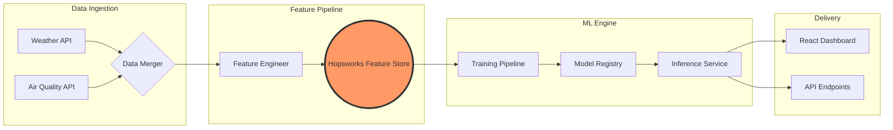

#  AirLyst: Islamabad's Smart AQI Forecasting Engine

<div align="center">

[](https://www.python.org/)
[](https://www.hopsworks.ai/)
[](https://pytorch.org/)
[](https://opensource.org/licenses/MIT)

---

### 🌬️ "Predicting the air you breathe, before you step out."

**AirLyst** is a production-grade MLOps pipeline designed to solve the air quality crisis in Islamabad. By fusing real-time weather and pollutant data, it provides actionable 72-hour forecasts powered by advanced machine learning.

[Explore Docs](#) • [Report Bug](#) • [Request Feature](#)

</div>

---

## 🚀 Key Features

- 🎯 **72-Hour Multi-step Forecasting**: Predicts the exact AQI level for every hour of the next 3 days.
- 🤖 **Hybrid ML Engine**: Supports Random Forest (99% R2) and Deep Learning (Stacked LSTM) for sequence memory.
- 📊 **Advanced Feature Engineering**: 21+ elite features including AQI/PM2.5 Lags (1h, 3h, 6h, 24h) and Rolling Windows.
- ☁️ **Cloud Feature Store**: Powered by **Hopsworks** for centralized data versioning and model registry.
- ⚡ **Real-time Ingestion**: Automated fusion of Open-Meteo weather and global Air Quality feeds.

---

## 🏗️ Technical Architecture



---

## 🌿 Health Advisory Guidelines

Based on our forecasts, AirLyst provides real-time health recommendations:

| AQI Range | Category | Health Recommendation 🏥 |
| :--- | :--- | :--- |
| **0 - 50** | 🟢 Good | Air quality is satisfactory. Enjoy outdoor activities! |
| **51 - 100** | 🟡 Moderate | Sensitive individuals should reduce prolonged outdoor exertion. |
| **101 - 150** | 🟠 Unhealthy (Sensitive) | Children and seniors should limit outdoor time. Wear a mask. |
| **151 - 200** | 🔴 Unhealthy | Everyone may experience effects. Use air purifiers indoors. |
| **201 - 300** | 🟣 Very Unhealthy | Health alert: Everyone should avoid outdoor physical activity. |
| **300+** | 🟤 Hazardous | Emergency condition: Stay indoors with windows closed. |

---

## 📂 Project Walkthrough

```bash
AirLyst/
├── 📂 backend/                 # Core logic and API
│   ├── 📂 src/
│   │   ├── 📂 data_ingestion/  # Raw API clients (Weather/AQI)
│   │   ├── 📂 feature_pipeline/# The heart of feature engineering (21+ features)
│   │   ├── 📂 models/          # Model architectures (LSTM, RF, GRU)
│   │   └── 📂 utils/           # Shared loggers and production configs
├── 📂 notebooks/               # Research, EDA & Experiments
├── 📄 .env                     # Secrets (Ignored by Git)
├── 📄 .gitignore               # Multi-layer exclusion (venv, caches, logs)
├── 📄 requirements.txt         # Production dependencies
└── 📄 README.md                # Project documentation
```

---

## 🛠️ Quick Start

### 1. Installation
```bash
git clone https://github.com/21Afnan/AirLyst.git
cd AirLyst
python -m venv venv
source venv/Scripts/activate  # Windows: venv\Scripts\activate
pip install -r requirements.txt
```

### 2. Execute Feature Pipeline
```bash
python backend/src/feature_pipeline/feature_engineer.py
```

---

## 📬 Connect & Collaborate

<div align="center">
  <p>Looking for collaborations or technical discussions on MLOps & Climate Tech!</p>

  <a href="https://linkedin.com/in/afnanshoukat" target="_blank">
    
  </a>
  &nbsp;&nbsp;
  <a href="mailto:afnanshoukat35@gmail.com">
    
  </a>
  &nbsp;&nbsp;
  <a href="https://github.com/21Afnan" target="_blank">
    
  </a>

  <br><br>
  
  
  <p><b>Crafted with Precision by Afnan Shoukat ❤️</b></p>
</div>
