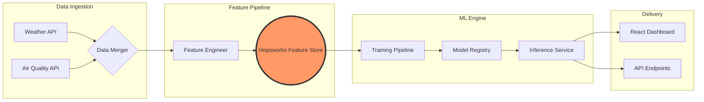

#  AirLyst: The Future of AQI Forecasting

<div align="center">

[](https://www.python.org/)
[](https://www.hopsworks.ai/)
[](https://pytorch.org/)
[](https://opensource.org/licenses/MIT)

---

### 🌬️ "Predicting the air you breathe, before you step out."

**AirLyst** is a state-of-the-art MLOps pipeline designed for Islamabad's high-precision AQI forecasting. It bridges the gap between raw environmental data and actionable health insights using a robust feature store and advanced time-series modeling.

[Explore Docs](#) • [Report Bug](#) • [Request Feature](#)

</div>

---

## 🚀 Key Features

- 🎯 **72-Hour Multi-step Forecasting**: Beyond just 'next-hour' predictions; we forecast the full 3-day horizon.
- 🤖 **Hybrid Model Support**: Engineered for both **Random Forest** (high accuracy) and **Stacked LSTM** (sequence memory).
- 📊 **Elite Feature Engineering**: Automated pipeline for 21+ features including AQI/PM2.5 Lags (1h-24h) and Rolling Averages.
- ☁️ **Hopsworks Integration**: Production-grade Feature Store for centralized data versioning and model registry.
- ⚡ **Real-time Ingestion**: Seamlessly fuses Open-Meteo weather data with Global Air Quality feeds.

---

## 🏗️ Project Architecture



---

## 📂 Project Structure Walkthrough

```bash
AirLyst/
├── 📂 backend/                 # Core logic and API
│   ├── 📂 src/
│   │   ├── 📂 data_ingestion/  # Raw API clients (Weather/AQI)
│   │   ├── 📂 feature_pipeline/# The heart of feature engineering
│   │   ├── 📂 models/          # Model architectures (LSTM, RF)
│   │   └── 📂 utils/           # Shared loggers and configs
├── 📂 notebooks/               # Research, EDA & Experiments
├── 📄 .env                     # Secrets (Ignored by Git)
├── 📄 .gitignore               # Multi-layer exclusion rules
├── 📄 requirements.txt         # Production dependencies
└── 📄 README.md                # Project documentation
```

---

## 🖼️ Model Performance Showcase

<div align="center">
  
  | Feature | Importance | Model | R2 Score |
  | :--- | :--- | :--- | :--- |
  | **us_aqi_lag_1h** | 0.9595 | **Random Forest** | **0.99** |
  | **pm2_5_rolling_24h**| 0.0146 | **LSTM** | **0.59** |
  | **hour** | 0.0038 | **XGBoost** | *Upcoming* |

</div>

---

## 🛠️ Installation & Setup

### 1. Clone & Environment
```bash
git clone https://github.com/21Afnan/AirLyst.git
cd AirLyst
python -m venv venv
source venv/Scripts/activate  # Windows: venv\Scripts\activate
```

### 2. Dependencies
```bash
pip install -r requirements.txt
```

### 3. Run Pipeline
```bash
# Engineer the "Certified" feature set
python backend/src/feature_pipeline/feature_engineer.py
```

---

## 📬 Connect & Collaborate

<div align="center">
  <p>Looking for collaborations or technical discussions on MLOps!</p>

  <a href="https://linkedin.com/in/afnanshoukat" target="_blank">
    
  </a>
  &nbsp;&nbsp;
  <a href="mailto:afnanshoukat35@gmail.com">
    
  </a>
  &nbsp;&nbsp;
  <a href="https://github.com/21Afnan" target="_blank">
    
  </a>

  <br><br>
  
  
  <p><b>Crafted with Precision by Afnan Shoukat</b></p>
</div>
