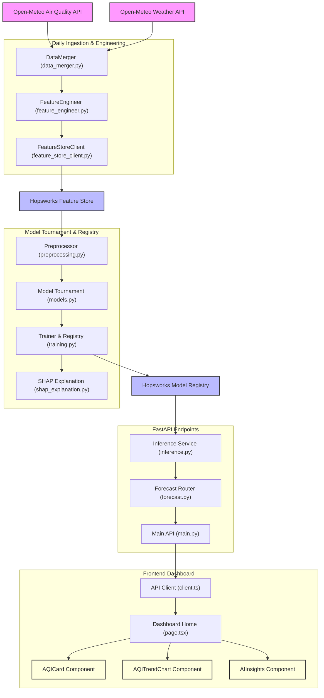

#  AirLyst: Enterprise-Grade AQI Forecasting System

<div align="center">

[](https://www.python.org/)
[](https://fastapi.tiangolo.com/)
[](https://nextjs.org/)
[](https://tailwindcss.com/)
[](https://www.hopsworks.ai/)
[](https://www.hopsworks.ai/)

---

### 🌬️ "Predicting the air you breathe, before you step out."

**AirLyst** is a state-of-the-art MLOps-driven Air Quality Index (AQI) forecasting system. It retrieves meteorological and environmental pollutant data, engineers advanced temporal features, trains a model tournament to select the best regressor, registers versioned models to the cloud, and serves hourly predictions with live SHAP explanations.

🌐 **[Experience the Live Web App Dashboard](https://airlyst.vercel.app)** *(Update this to your production domain)*

[Technical Deep-Dive Docs](file:///c:/Users/Dell/Desktop/AirLyst/project_deep_dive_analysis.md) • [Report Issue](https://github.com/21Afnan/AirLyst/issues) • [Request Feature](https://github.com/21Afnan/AirLyst/issues)

</div>

---

## ⚡ MLOps System Architecture

AirLyst bridges the gap between raw data engineering and live user dashboards. The architecture is split into clean, modularized pipelines using the **Hopsworks Feature Store** to prevent training-serving skew.



---

## ⚙️ Core MLOps Components Explained

If you are new to the codebase, here are the key MLOps components that power AirLyst:

### 1. Unified Feature Store (Hopsworks)
- **What it solves**: Prevents training-serving skew by using a single source of truth for both offline training and online serving.
- **Pipeline**: Daily cron runs `run_feature_pipeline.py` which pulls the latest weather and air data, engineers features, and pushes them to Hopsworks.

### 2. Temporal Feature Engineering
- **Lags**: Captures historical momentum by shifting target values: `us_aqi_lag_1h`, `us_aqi_lag_3h`, `us_aqi_lag_6h`, and `us_aqi_lag_24h`.
- **Rolling Statistics**: Tracks trend directions using 6-hour and 24-hour moving averages of PM2.5.

### 3. Model Tournament & Registry
- **Contenders**: Trains and compares Ridge Regression, Random Forest, XGBoost, and LightGBM.
- **Validation**: Uses strict **Chronological Splitting** instead of random splits to prevent data leakage.
- **Metric Tournament**: Models are ranked using a composite score based on MAE, RMSE, and R² scores. The best model is serialized and pushed to the Hopsworks Model Registry.

### 4. Explainable AI (SHAP)
- **Global Explanations**: During training, SHAP computes global feature importances and exports beeswarm plots to the `reports` directory.
- **Real-Time Local Explanations**: When `/api/forecast` is called, `shap.TreeExplainer` is evaluated on the fly to determine the top 2 features driving the prediction, and translates them into user-friendly text (e.g., "warm weather trapping dirty air" or "traffic exhaust fumes").

---

## 🖼️ Premium UI/UX Features

The frontend application in `frontend/` is built using Next.js 14, Tailwind CSS, and Recharts:
* 🌟 **Glassmorphic Stat Cards**: Lift-on-hover cards showing daily forecasts with ambient background glows.
* 📈 **Interactive Severity Trends**: 24-hour interactive charts shaded by standard US-EPA AQI health levels.
* 🌓 **Dynamic Themes**: Beautiful animations, transitions, and native dark/light modes.
* 🧩 **Fail-Safe Mock Data**: The frontend api client detects if the FastAPI server is down and gracefully falls back to realistic mock predictions to ensure the UI remains fully functional.

---

## 📂 Project Structure

```bash
AirLyst/
├── backend/                    # FastAPI Backend
│   ├── data/                   # Cache & local data files
│   ├── logs/                   # System logging (Rotating pipeline.log)
│   ├── models/                 # Local fallback .joblib files
│   ├── reports/                # SHAP beeswarm & bar importance plots
│   └── src/                    # Python Source
│       ├── api/                # FastAPI routing & CORS configuration
│       ├── data_ingestion/     # Clients to ingest Open-Meteo variables
│       ├── feature_pipeline/   # Lag calculations, rolling averages & Hopsworks sync
│       ├── ml/                 # Tournament training, unified loader & inference + SHAP
│       └── utils/              # Configuration validations, schemas & logging settings
├── frontend/                   # Next.js App
│   ├── app/                    # Global styling (globals.css), layout, & index
│   ├── components/             # Reusable UI widgets (AQICard, WeatherWidget, TrendChart)
│   ├── hooks/                  # Responsive and toast custom hooks
│   └── lib/                    # API client with fallback mock data & typings
├── .env                        # Local environments (API keys, project settings)
├── requirements.txt            # Python dependencies
└── README.md                   # Project landing page
```

---

## 🚀 Quick Setup & Getting Started

### 🐍 Backend setup
```bash
# Set up Python Environment
python -m venv venv
venv\Scripts\activate  # Windows
source venv/bin/activate  # Unix/Mac

# Install Packages
pip install -r requirements.txt

# Start Server
uvicorn backend.src.api.main:app --reload --port 8000
```
*API docs will be available at http://localhost:8000/docs*

### ⚛️ Frontend setup
```bash
cd frontend
pnpm install
pnpm dev
```
*Web dashboard will be available at http://localhost:3000*

---

## 🛸 Hosting & Deployment Guide

### Frontend Deployment (Vercel)
The easiest way to deploy your Next.js application:
1. Connect your repository to **Vercel**.
2. Configure Environment variables (if you have custom backend endpoints).
3. Vercel will auto-detect the Next.js setup, compile with Turbopack, and build a globally distributed static web application.

### Backend Deployment (Render or AWS)
To deploy your FastAPI server:
1. Set up a Web Service on **Render**.
2. Add your `.env` secrets (e.g. `HOPSWORKS_API_KEY`, URLs, project details).
3. Use the start command:
   ```bash
   uvicorn backend.src.api.main:app --host 0.0.0.0 --port $PORT
   ```

---
<p align="center"><b>Designed with ❤️ by the AirLyst Team. Powered by Hopsworks, FastAPI, and Next.js.</b></p>
