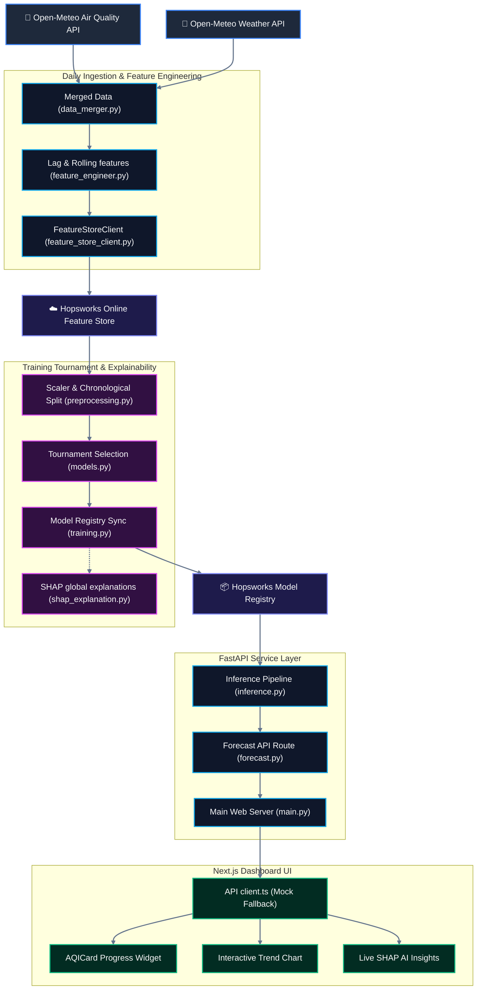

<div align="center">

# 🌌 <span style="background: linear-gradient(135deg, #00f2fe 0%, #4facfe 100%); -webkit-background-clip: text; -webkit-text-fill-color: transparent; font-weight: 800; font-size: 3rem;">AeroVibe: Precision AQI Engine</span>

### 🌬️ "Predicting the air you breathe, powered by state-of-the-art MLOps."

<p align="center">
  <a href="https://airlyst.vercel.app" target="_blank">
    
  </a>
</p>

[](https://www.python.org/)
[](https://fastapi.tiangolo.com/)
[](https://nextjs.org/)
[](https://tailwindcss.com/)
[](https://www.hopsworks.ai/)

</div>

---

## ⚡ Interactive System Architecture

**AeroVibe** (formerly AirLyst) uses a decoupled, dual-stage pipeline that integrates weather & air quality ingestion, sliding temporal window engineering, model tournament selection, cloud-hosted registries, and live SHAP-based local explainability.



---

## 📷 Interactive Dashboard Showcase

Here is a visual walk-through of the premium **AeroVibe Next.js Frontend Dashboard** showing real-time observations, 72-hour forecast charts, and local AI explanation widgets:

<div align="center">
  <table>
    <tr>
      <td width="33.3%" align="center">
        
        <br />
        <b>1. Main Dashboard View</b>
        <p><i>Real-time AQI dials, weather metrics, and daily predictions.</i></p>
      </td>
      <td width="33.3%" align="center">
        
        <br />
        <b>2. AI SHAP Insights</b>
        <p><i>Local Shapley explanations translating variables to human language.</i></p>
      </td>
      <td width="33.3%" align="center">
        
        <br />
        <b>3. Hourly Trends Chart</b>
        <p><i>EPA-banded 24-hour predictive line chart with tooltips.</i></p>
      </td>
    </tr>
  </table>
</div>

---

## ⚙️ Core MLOps Components Explained

* **Feature Store Integration**: AeroVibe uses the **Hopsworks Feature Store** to store engineered targets, avoiding training-serving skew.
* **Temporal Lags & Rolles**: Computes sliding temporal lags (`1h`, `3h`, `6h`, `24h`) and running statistics (6h & 24h moving averages of particulate concentrations).
* **Model Tournament**: Retrains weekly. Competes Ridge, Random Forest, XGBoost, and LightGBM models using custom chronological time-series splitting to avoid future data leakage.
* **Dynamic LLM Translations**: Integrates **OpenRouter API** with the **`google/gemini-2.5-flash`** model to translate technical air quality drivers into friendly, 1-sentence explanations dynamically.
* **Live SHAP Explanations**: The `/explain` endpoint dynamically aggregates and calculates the absolute SHAP values across all real-time hourly forecasts in memory, ensuring that the model's feature importance rankings instantly adapt to live weather and pollution patterns.

---

## 🚀 Setup & Execution Guide

### 🐍 Backend Service (FastAPI)
```bash
# Activate virtual environment
python -m venv venv
venv\Scripts\activate

# Install requirements
pip install -r requirements.txt

# Run server
uvicorn backend.src.api.main:app --reload --port 8000
```
*Swagger docs run at: http://localhost:8000/docs*

### ⚛️ Frontend UI (Next.js)
```bash
cd frontend
pnpm install
pnpm dev
```
*Interactive dashboard runs at: http://localhost:3000*

---

## 👨‍💻 Built & Engineered By

<div align="center">

### **Afnan Shoukat**

<p>
  <a href="https://linkedin.com/in/afnanshoukat" target="_blank">
    
  </a>
  &nbsp;&nbsp;
  <a href="https://github.com/21Afnan" target="_blank">
    
  </a>
  &nbsp;&nbsp;
  <a href="mailto:afnanshoukat35@gmail.com">
    
  </a>
</p>

</div>
