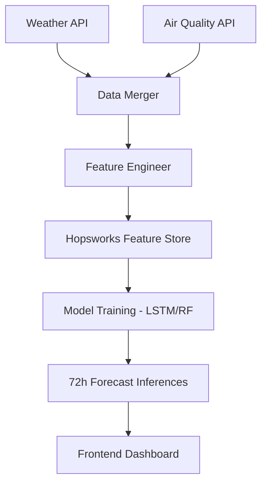

# 🌬️ AirLyst: High-Precision AQI Forecasting Pipeline

<div align="center">
  
  
  
  
</div>

---

## 🚀 Overview
**AirLyst** is an end-to-end MLOps pipeline for high-precision time-series AQI forecasting in Islamabad. It integrates real-time air quality and weather data via a **Hopsworks Feature Store**, automating the full data lifecycle—from ingestion to advanced feature engineering—to deliver reliable 72-hour air quality predictions.

---

## 🏗️ Project Architecture


---

## ✨ Key Features
- **🎯 Super-Slim Pipeline:** Engineered 21+ elite features including temporal markers (hour, day, month), AQI lags (1h-24h), and PM2.5 rolling averages.
- **☁️ Cloud-Native Feature Store:** Seamless integration with Hopsworks for data versioning and consistent training/inference.
- **🧠 Advanced Forecasting:** Support for both high-performance Random Forest and Deep Learning (Stacked LSTM) architectures.
- **⚡ Real-time Ingestion:** Automated data fetching and cleaning for Islamabad city metrics.

---

## 🛠️ Technology Stack
- **Languages:** 
- **Frameworks:**  
- **MLOps:** 
- **Data:**  

---

## 🚀 Getting Started

### 1. Installation
```bash
git clone https://github.com/21Afnan/AirLyst.git
cd AirLyst
pip install -r requirements.txt
```

### 2. Run Feature Pipeline
```bash
python backend/src/feature_pipeline/feature_engineer.py
```

### 3. Train Model
```bash
python backend/src/models/lstm_trainer.py
```

---

## 📊 Model Performance
| Model | MAE | RMSE | R2 Score |
| :--- | :--- | :--- | :--- |
| Random Forest | ~1.5 | ~2.8 | 0.99 |
| LSTM (20 Epochs) | 12.2 | 16.4 | 0.59 |

---

## 🗺️ Roadmap
- [x] Data Ingestion & Backfill
- [x] Feature Engineering (Top 15 Elite)
- [x] LSTM Baseline Training
- [ ] Hopsworks Feature Store Sync (Phase 3)
- [ ] Interactive Streamlit Dashboard
- [ ] Daily Automated Forecasting Jobs

---

<div align="center">
  Developed with ❤️ for a cleaner Islamabad 🌿
</div>
