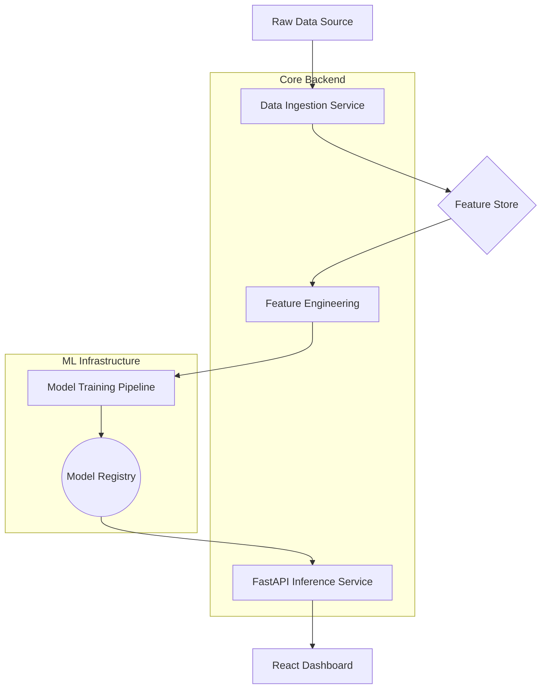

#  AirLyst: Advanced AQI Forecasting System

<div align="center">

[](https://www.python.org/)
[](https://fastapi.tiangolo.com/)
[](https://scikit-learn.org/)
[](https://xgboost.readthedocs.io/)
[](https://opensource.org/licenses/MIT)

---

### 🌬️ "Predicting the air you breathe, before you step out."

**AirLyst** is a state-of-the-art Air Quality Index (AQI) forecasting pipeline. It leverages classical ML (XGBoost, LightGBM, Random Forest) and Deep Learning (LSTM, GRU) to provide accurate 72-hour forecasts.

[Explore Docs](#) • [Report Bug](#) • [Request Feature](#)

</div>

---

## ✨ Features

- 🎯 **72-Hour Multi-step Forecasting**: Precise hourly predictions for the next 3 days.
- 🤖 **Hybrid Model Architecture**: Supports XGBoost, LightGBM, Random Forest, and Attention-based LSTMs.
- 📊 **Feature Engineering Service**: Automated lag features, rolling windows, and weather integration.
- ☁️ **Hopsworks Integration**: Centralized feature store and model registry for production-grade ML.
- 🏥 **Health Insights**: Categorical AQI mapping (1-5) with actionable health recommendations.

---

## 🖼️ Project Showcase

<div align="center">
  <p align="center">
    
  </p>
  
  <table>
    <tr>
      <td width="50%">
        
        <p align="center"><i>Interactive Dashboard</i></p>
      </td>
      <td width="50%">
        
        <p align="center"><i>Model Performance Metrics</i></p>
      </td>
    </tr>
    <tr>
      <td width="50%">
        
        <p align="center"><i>SHAP Feature Importance</i></p>
      </td>
      <td width="50%">
        
        <p align="center"><i>FastAPI Documentation</i></p>
      </td>
    </tr>
  </table>
</div>

---

## 🚀 Getting Started

### 🛠️ Installation

1. **Clone the repository**
   ```bash
   git clone https://github.com/yourusername/AirLyst.git
   cd AirLyst
   ```

2. **Set up Virtual Environment**
   ```bash
   python -m venv venv
   source venv/Scripts/activate  # On Windows: venv\Scripts\activate
   ```

3. **Install Dependencies**
   ```bash
   pip install -r backend/requirements.txt
   ```

4. **Environment Variables**
   Create a `.env` file in the root directory:
   ```env
   HOPSWORKS_API_KEY=your_key_here
   WEATHER_API_KEY=your_key_here
   ```

5. **Run the Application**
   - **Start Backend:** `uvicorn backend.main:app --reload`
   - **Start Frontend:** Open `frontend-web/index.html` in your browser or run:
     ```bash
     python -m http.server 3000 --directory frontend-web
     ```

---

## 🏗️ Project Structure

```bash
AirLyst/
├── backend/            # FastAPI source code
│   ├── api/            # API endpoints
│   ├── ml/             # Model training & inference logic
│   └── services/       # Feature engineering & data services
├── notebooks/          # Experimental analysis
├── venv/               # Virtual environment (ignored)
└── .gitignore          # Git exclusion rules
```

---
---

## 🏗️ Detailed Project Architecture

<div align="center">
  
</div>



### 📂 Directory Walkthrough

```bash
AirLyst/
├── 📂 frontend-web/            # Modern Web Dashboard
│   ├── 📄 index.html           # Main structure
│   ├── 📄 style.css            # Premium styling
│   └── 📄 script.js            # Frontend logic & charts
├── 📂 backend/                 # Core logic and API
│   ├── 📂 api/                 # FastAPI routes and middleware
│   │   └── 📄 main.py          # Entry point for the server
│   ├── 📂 ml/                  # Machine Learning core
│   │   ├── 📄 models.py        # Model definitions (LSTM, GRU, etc.)
│   │   └── 📄 trainer.py       # Training and evaluation logic
│   └── 📂 services/            # Business logic
│       ├── 📄 feature_eng.py   # Advanced feature engineering
│       └── 📄 data_fetcher.py  # External API integrations
├── 📂 notebooks/               # Research & EDA
│   └── 📄 experiment_v1.ipynb  # Initial prototyping
├── 📄 .env                     # Secrets (Ignored by Git)
├── 📄 .gitignore               # Exclusion rules
├── 📄 README.md                # Project documentation
```

---

## 🌟 Acknowledgments & Shoutouts

<div align="center">
  
  
  > "Innovation distinguishes between a leader and a follower. This project is a testament to the power of open-source and modern AI."
</div>

Special thanks to:
- **[Hopsworks](https://www.hopsworks.ai/)** for providing an incredible Feature Store infrastructure.
- **[FastAPI](https://fastapi.tiangolo.com/)** for the lightning-fast performance.
- All the open-source contributors whose libraries made this possible.

---

## 📬 Connect With Me

<div align="center">
  <p>Feel free to reach out for collaborations or just a friendly chat about AI!</p>

  <a href="https://linkedin.com/in/afnanshoukat" target="_blank">
    
  </a>
  &nbsp;&nbsp;
  <a href="mailto:afnanshoukat35@gmail.com">
    
  </a>
  &nbsp;&nbsp;
  <a href="https://github.com/21Afnan/21Afnan" target="_blank">
    
  </a>

  <br><br>
  
  
  <p><b>Created with ❤️ by the AirLyst Team</b></p>
</div>
