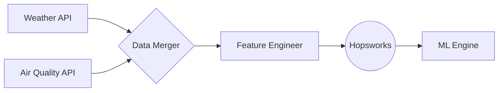

#  AirLyst: Islamabad's Smart AQI Forecasting

<div align="center">

[](https://www.python.org/)
[](https://www.hopsworks.ai/)
[](https://pytorch.org/)

### 🌬️ "Predicting the air you breathe, before you step out."

---

</div>

## 🚀 Key Features
- 🎯 **72-Hour Forecasting**: Precision hourly predictions for the 3-day horizon.
- 🤖 **Hybrid ML Engine**: Supports Random Forest and Stacked LSTM architectures.
- 📊 **Elite Features**: 21+ features including AQI/PM2.5 Lags and Rolling Windows.
- ☁️ **Cloud Feature Store**: Seamless integration with **Hopsworks**.

---

## 🏗️ Technical Architecture


---

## 🌿 Health Advisory Matrix
| AQI Range | Category | Health Recommendation 🏥 |
| :--- | :--- | :--- |
| **0 - 50** | 🟢 Good | Enjoy outdoor activities! |
| **51 - 100** | 🟡 Moderate | Sensitive individuals reduce outdoor exertion. |
| **101 - 150** | 🟠 Unhealthy | Children and seniors wear a mask. |
| **151 - 200** | 🔴 Unhealthy | Everyone limit outdoor time. |
| **300+** | 🟤 Hazardous | Stay indoors with windows closed. |

---

## 🛠️ Quick Start
```bash
git clone https://github.com/21Afnan/AirLyst.git
pip install -r requirements.txt
python backend/src/feature_pipeline/feature_engineer.py
```

---

## 📬 Connect & Collaborate
<div align="center">
  <a href="https://linkedin.com/in/afnanshoukat"></a>
  &nbsp;
  <a href="mailto:afnanshoukat35@gmail.com"></a>
  &nbsp;
  <a href="https://github.com/21Afnan"></a>

  <br><br>
  
  
  <p><b>Crafted with Precision by Afnan Shoukat ❤️</b></p>
</div>
