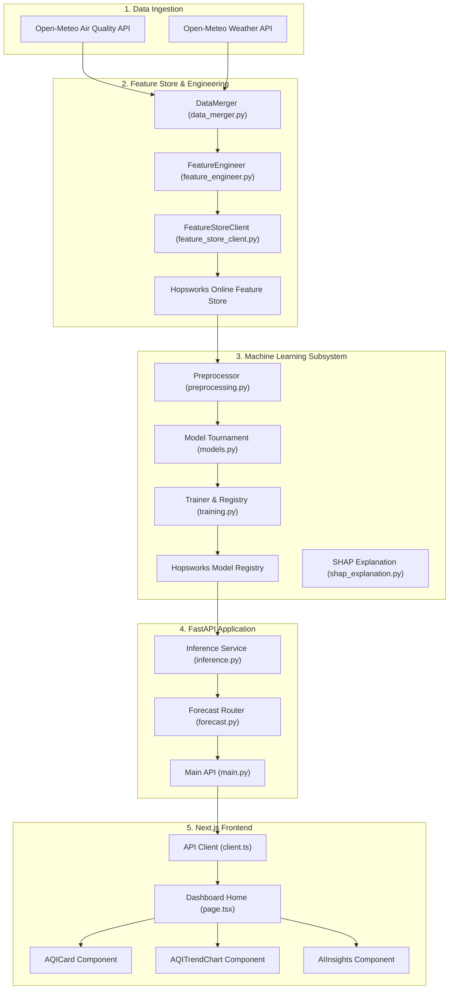

# 🌬️ AirLyst: Advanced AQI Forecasting System — Deep-Dive Codebase Analysis

Welcome to the comprehensive technical documentation and system architecture deep-dive of the **AirLyst** repository. This document walks through the entire platform from foundational concepts (0) to production-grade engineering patterns (Advanced), mapping the logic, responsibilities, and behavior of every component and file.

---

## 🗺️ High-Level System Architecture

AirLyst is a production-grade machine learning system designed to predict hourly Air Quality Index (AQI) values up to 72 hours into the future. The system combines classical data-science design patterns with modern MLOps tools.



---

## 🛠️ Part 1: Core Backend Analysis (`backend/`)

The backend is built in Python using **FastAPI** for serving predictions, **Scikit-Learn / XGBoost / LightGBM** for modeling, and **Hopsworks** as the centralized Feature Store and Model Registry.

### 1. Configuration & Utilities (`src/utils/`)

These modules represent the foundational settings, schemas, and logging structures used across the backend.

#### 📄 [constants.py](file:///c:/Users/Dell/Desktop/AirLyst/backend/src/utils/constants.py)
* **What it does:** Centralizes definition of external API features requested from Open-Meteo.
* **Basic (0):** Lists the variables we care about: weather variables (temperature, pressure, wind speed) and air quality variables (PM2.5, PM10, SO₂, CO, NO₂, and target AQI).
* **Advanced:** Ensuring exact match of external parameter names prevents spelling mismatches during ingestion across both historical backfills and live updates.

#### 📄 [schemas.py](file:///c:/Users/Dell/Desktop/AirLyst/backend/src/utils/schemas.py)
* **What it does:** Defines data validation rules using **Pydantic**.
* **Basic (0):** It defines two validation classes: `WeatherData` and `AirQualityData`. When we query external APIs, Pydantic ensures the parameters match the expected types (e.g., `time` is a valid datetime, numerical columns are floats or ints).
* **Advanced:** Provides runtime data validation. If an external API changes its format or returns nulls/strings, the system throws a descriptive validation error instead of leaking corrupt or unaligned data into our feature store.

#### 📄 [logger.py](file:///c:/Users/Dell/Desktop/AirLyst/backend/src/utils/logger.py)
* **What it does:** Sets up a rotating logging system that writes output to console (`sys.stdout`) and saves permanent history inside a log file (`backend/logs/pipeline.log`).
* **Basic (0):** Creates clean logs showing the status of backend tasks.
* **Advanced:** Uses `RotatingFileHandler` with a cap of 5MB and keeps up to 3 backup log files. This avoids consuming the server's disk space over long running periods.

#### 📄 [config.py](file:///c:/Users/Dell/Desktop/AirLyst/backend/src/utils/config.py)
* **What it does:** Single source of truth for environments. Uses `dotenv` to load coordinates (default: Islamabad at Latitude 33.72, Longitude 73.04), Hopsworks API keys/parameters, and endpoint URLs.
* **Basic (0):** Reads configuration parameters from `.env` so we do not hardcode secrets or coordinates.
* **Advanced:** Validates required keys immediately upon loading. If crucial variables like `HOPSWORKS_API_KEY` are missing, it interrupts execution with a descriptive error. It also loads `HOPSWORKS_PROJECT` and `HOPSWORKS_HOST` configurations for seamless cloud synchronization and dynamically computes temporal sliding windows (`get_backfill_dates` for historical data and `get_update_dates` for daily increments).

---

### 2. Data Ingestion Layer (`src/data_ingestion/`)

Responsible for communicating with external Fast APIs and cleaning data.

#### 📄 [air_quality_client.py](file:///c:/Users/Dell/Desktop/AirLyst/backend/src/data_ingestion/air_quality_client.py)
* **What it does:** Queries Open-Meteo Air Quality API to retrieve historical and real-time pollutant levels.
* **Basic (0):** Sends a HTTP GET request with coordinate parameters, parses the JSON payload, and formats it as a Pandas DataFrame.
* **Advanced:** Leverages Pydantic validation by converting DataFrame records to Pydantic objects:
  ```python
  validated_records = [AirQualityData(**row).model_dump() for row in df.to_dict('records')]
  ```
  This creates a defensive validation barrier immediately upon ingesting data.

#### 📄 [weather_client.py](file:///c:/Users/Dell/Desktop/AirLyst/backend/src/data_ingestion/weather_client.py)
* **What it does:** Identical structure to `air_quality_client.py`, but configured for meteorological parameters (temperature, pressure, wind).
* **Basic (0):** Handles weather data querying for the configured latitude and longitude.
* **Advanced:** Automatically adjusts timezones using the `"timezone": "auto"` parameter to ensure consistency with localized local-time observations.

---

### 3. Feature Pipeline & Feature Store (`src/feature_pipeline/`)

In modern machine learning, features should be stored in a centralized store to ensure that training and inference utilize identical calculations.

#### 📄 [data_merger.py](file:///c:/Users/Dell/Desktop/AirLyst/backend/src/feature_pipeline/data_merger.py)
* **What it does:** Combines weather and air quality datasets into a master dataset.
* **Basic (0):** Performs an inner join on the `time` column.
* **Advanced:** Implements quality control steps:
  1. Drops duplicate indices on the time axis (`drop_duplicates`).
  2. Eliminates rows containing NaN values (`dropna`).
  3. Logs detailed stats on rows removed to catch data gaps.

#### 📄 [feature_engineer.py](file:///c:/Users/Dell/Desktop/AirLyst/backend/src/feature_pipeline/feature_engineer.py)
* **What it does:** Transforms raw time-series data into predictive features.
* **Basic (0):** Extracts time attributes (hour of the day, day of the week, month) to capture daily, weekly, and seasonal trends.
* **Advanced:** Constructs lag and rolling averages to capture temporal dependencies:
  * **Lags:** Shift target fields back in time (`us_aqi_lag_1h`, `us_aqi_lag_3h`, `us_aqi_lag_6h`, `us_aqi_lag_24h`, `pm2_5_lag_6h`, `pm2_5_lag_24h`).
  * **Rolling Windows:** Computes moving averages of PM2.5 (`pm2_5_rolling_6h`, `pm2_5_rolling_24h`) to capture trend direction.
  * **Defensive Clean:** Drops initial rows that get NaN values due to the temporal shifting windows.

#### 📄 [feature_store_client.py](file:///c:/Users/Dell/Desktop/AirLyst/backend/src/feature_pipeline/feature_store_client.py)
* **What it does:** Handles reads/writes with the **Hopsworks Feature Store**.
* **Basic (0):** Uploads our processed data to the cloud or reads it back.
* **Advanced:** Enables the Hopsworks Online Store (`online_enabled=True`). It checks the primary keys (`time`) of incoming records against current records to determine the number of rows to **Append** vs. **Update**.

#### 📄 [run_feature_pipeline.py](file:///c:/Users/Dell/Desktop/AirLyst/backend/src/feature_pipeline/run_feature_pipeline.py)
* **What it does:** Orchestrates the daily incremental update process.
* **Basic (0):** A runner script that fetches the last 7 days of raw data, runs them through the feature engineering pipeline, and pushes updates to Hopsworks.
* **Advanced:** Configured as a daily batch job to ensure that the Feature Store is always up to date with the latest observed air quality conditions.

#### 📄 [verify_feature_store.py](file:///c:/Users/Dell/Desktop/AirLyst/backend/src/feature_pipeline/verify_feature_store.py)
* **What it does:** Diagnostic script to fetch and print the head of the remote Hopsworks Feature Group to confirm synchronization.

---

### 4. Machine Learning Engine (`src/ml/`)

This directory houses the model definitions, training loops, evaluation logic, and explainability subsystems.

#### 📄 [models.py](file:///c:/Users/Dell/Desktop/AirLyst/backend/src/ml/models.py)
* **What it does:** Defines a suite of regression models to participate in our tournament: **Ridge Regression**, **Random Forest**, **XGBoost**, and **LightGBM**.
* **Basic (0):** Houses the initialized estimator objects.
* **Advanced:** Standardizes the hyper-parameters and random states across models to ensure fair comparisons.

#### 📄 [preprocessing.py](file:///c:/Users/Dell/Desktop/AirLyst/backend/src/ml/preprocessing.py)
* **What it does:** Handles chronological splitting, scaling, and serialization of data.
* **Basic (0):** Splits the dataset into train and test sets, and scales the inputs.
* **Advanced:** 
  * **Chronological Split:** Splitting is done sequentially based on time (e.g., first 80% for training, last 20% for testing) instead of a random split. This prevents data leakage (using the future to predict the past).
  * **Scaler Hygiene:** The `StandardScaler` is fitted *only* on the training split and applied to the test split to avoid leakage of summary statistics (mean/variance) from the test set.

#### 📄 [training.py](file:///c:/Users/Dell/Desktop/AirLyst/backend/src/ml/training.py)
* **What it does:** Orchestrates the model training tournament, evaluates performance, exports model binaries, and registers the winning model on Hopsworks.
* **Basic (0):** Loops through models, fits them on training data, and calculates test metrics (MAE, RMSE, R2 Score).
* **Advanced:** 
  1. Computes a **Composite Rank Score** across MAE, RMSE, and R2 to select the best-performing model.
  2. Saves the winning model, scaler, and feature metadata locally as `.joblib` files.
  3. Connects to Hopsworks and uploads the assets to the **Hopsworks Model Registry** as versioned assets.
  4. Provides the utility function `get_aqi_status` to convert continuous AQI numbers to US-EPA standard status categories:
     * $\le 50$: Good
     * $51 - 100$: Moderate
     * $101 - 150$: Unhealthy for Sensitive Groups (SG)
     * $151 - 200$: Unhealthy
     * $201 - 300$: Very Unhealthy
     * $> 300$: Hazardous

#### 📄 [shap_explanation.py](file:///c:/Users/Dell/Desktop/AirLyst/backend/src/ml/shap_explanation.py)
* **What it does:** Uses **SHAP (SHapley Additive exPlanations)** to interpret model predictions.
* **Basic (0):** Explains which features are most important.
* **Advanced:** 
  * Computes the marginal contribution of each feature to the predicted AQI score.
  * Exports two diagnostic plots to `backend/reports/`: `shap_summary.png` (beeswarm plot showing impact distribution) and `shap_bar.png` (global feature importance bar plot).
  * Generates a textual report explaining the feature relationships (e.g. how high lag AQI values or rolling averages of PM2.5 impact the predictions).

#### 📄 [model_loader.py](file:///c:/Users/Dell/Desktop/AirLyst/backend/src/ml/model_loader.py)
* **What it does:** Utility to retrieve the trained model, scaler, and metadata.
* **Basic (0):** Loads the `.joblib` files.
* **Advanced:** Connects to the Hopsworks Model Registry using the project configuration arguments (`host=settings.HOPSWORKS_HOST`, `project=settings.HOPSWORKS_PROJECT`, and `api_key_value=settings.HOPSWORKS_KEY`) to fetch the latest version of the model. If the Hopsworks connection fails, it automatically falls back to reading local `.joblib` files stored in `backend/models/`.

#### 📄 [inference.py](file:///c:/Users/Dell/Desktop/AirLyst/backend/src/ml/inference.py)
* **What it does:** Runs the predictive pipeline for real-time inference.
* **Basic (0):** Takes current weather and air quality readings and predicts the AQI.
* **Advanced:** 
  1. Fetches current/historical data (past 2 days) to populate lag features, along with future forecasts (next 3 days). Requests utilize `verify=False` and `urllib3.disable_warnings` to handle SSL proxy/validation issues in localized environments.
  2. Applies `FeatureEngineer` to construct identical feature structures as used during training.
  3. Segregates rows into "current" (the current hour) and "forecast" (the next 72 hours).
  4. Feeds variables to `StandardScaler` and makes predictions.
  5. Computes live SHAP values for each individual prediction using `shap.TreeExplainer` on the winning model.
  6. Returns a structured dictionary: `{"current": predictions[0], "forecast": predictions[1:]}` for downstream consumption by routers.

---

### 5. FastAPI serving layer (`src/api/`)

The entrypoint and route definitions for our REST API.

#### 📄 [main.py](file:///c:/Users/Dell/Desktop/AirLyst/backend/src/api/main.py)
* **What it does:** Configures the web server, mounts CORS middleware, and starts the API on port 8000.
* **Basic (0):** Initializes the FastAPI app instance and includes routing logic.
* **Advanced:** Implements CORS rules (`allow_origins=["*"]`) to allow our Next.js frontend to securely retrieve data. Includes a `/api/health` endpoint monitoring location parameters and connection status.

#### 📄 [forecast.py](file:///c:/Users/Dell/Desktop/AirLyst/backend/src/api/routes/forecast.py)
* **What it does:** Implements endpoints `/api/forecast` and `/api/forecast/explain`.
* **Basic (0):** Exposes JSON responses for the frontend.
* **Advanced:** 
  * `/api/forecast`: Executes the inference pipeline, filters hourly predictions, groups predictions by day, and averages real-time SHAP values. It formats predictions with `predicted_aqi` and `actual_aqi` fields and maps the top SHAP drivers to user-friendly reasons (e.g., mapping `us_aqi_lag_1h` to "pollution already floating in the air from previous hours", `nitrogen_dioxide` to "smoke and exhaust fumes from traffic traffic", etc.).
  * `/api/forecast/explain`: Parses the textual SHAP report generated during training, extracts rankings and weights, and returns structured JSON representation for use in dashboards.

---

## 🎨 Part 2: Frontend Analysis (`frontend/`)

The frontend is a Next.js 14 React application, styled using Tailwind CSS and Lucide React icons.

### 📄 [page.tsx](file:///c:/Users/Dell/Desktop/AirLyst/frontend/app/page.tsx)
* **What it does:** The main interface dashboard.
* **Basic (0):** Manages the dashboard's React state, displays loading circles, handles errors, and renders layout cards.
* **Advanced:** 
  * Triggers API fetches and sets up a 5-minute auto-refresh cycle.
  * Features a dynamic background with animated decorative elements.
  * Analyzes predicted AQI scores to apply matching color gradients (emerald green, amber yellow, orange, and rose red) for high-contrast warnings.
  * Iterates through daily summaries and parses real-time SHAP text strings.

### 📄 [client.ts](file:///c:/Users/Dell/Desktop/AirLyst/frontend/lib/api/client.ts)
* **What it does:** Handles client-side HTTP requests to the FastAPI backend.
* **Basic (0):** Uses `fetch` to connect to `http://localhost:8000`.
* **Advanced:** 
  * Attempts to fetch data from the FastAPI endpoints (`/api/forecast` and `/api/health`).
  * If the backend is offline, it automatically falls back to localized mock data. This ensures the UI remains functional during local testing if the backend is not running.

---

## 🔄 Part 3: End-to-End Integration Flow

The diagram below illustrates how components interact during the data ingestion, training, and real-time prediction loops.

```
[Open-Meteo REST APIs]
         │ (Ingestion with verify=False)
         ▼
 [data_merger.py] ──► [feature_engineer.py] ──► [feature_store_client.py]
                                                           │ (Upload / Read)
                                                           ▼
                                                 [Hopsworks Feature Store]
                                                           │ (Retrieve Features)
                                                           ▼
                                                  [preprocessing.py]
                                                           │ (Scale & Split)
                                                           ▼
                                                   [training.py] ◄──► [models.py]
                                                           │ (Find best model)
                                                           ▼
                                                [Hopsworks Model Registry]
                                                           │ (Download Latest)
                                                           ▼
                                                   [inference.py] (Returns Dict)
                                                           │ (Predict & Live SHAP)
                                                           ▼
                                                  [forecast.py] (FastAPI Router)
                                                           │ (HTTP JSON API)
                                                           ▼
                                                   [client.ts] (Next.js Fetch / Fallback)
                                                           │ (Render State)
                                                           ▼
                                                     [page.tsx] (UI View)
```

---
*Document prepared for the AirLyst Development Team. Powered by Hopsworks, FastAPI, and Next.js.*
